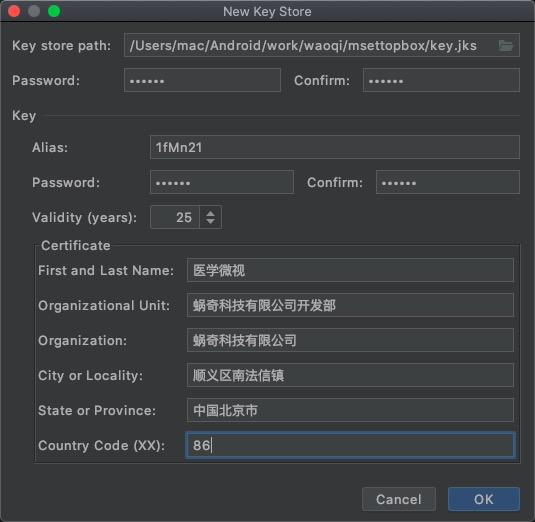

# 医学卫视项目
[使用框架](https://github.com/limedroid/XDroidMv)

# v1.0.5
修改
1、机顶盒参数支持以下节点：
IsThirdPartyCDN
CDNTPDomainName
2、判断IsThirdPartyCDN：
若为0或其他，则获取CDNAddress、BackupCDNAddress参数进行拼接；
若为1，则取CDNTPDomainName中的域名进行拼接，不再用CDNAddress的地址进行拼接
3、做好容错，部分盒子没有IsThirdPartyCDN、CDNTPDomainName这两个节点，所以如果读不到，需获取CDNAddress、BackupCDNAddress参数进行拼接。
4、节点读取方法为：上述节点同机顶盒其他参数获取方法，通过DevInfoManager获取，若获取不到，
可用以下方法读取上述IsThirdPartyCDN、CDNTPDomainName节点的值：SWDevInfoManager.getDevInfoManager(context).getValue("字段名称")

- 视频详情页定位到 立即播放

# v1.0.4
- 搜索键盘
- 小图
- 广告位置统计
- 放大图片模糊，去掉效果
- 分类选择

# v1.0.3  
- 添加跳转位置 

- [x] 自定义键盘
- [x] 播放记录同步
- [x] 语音控制
- [x] https支持

